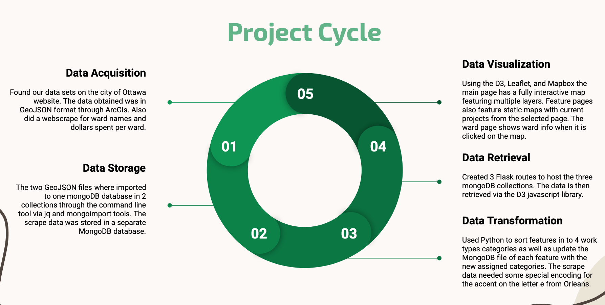

# Ottawa-Construction
### *Project 3*

---

If you're from Ottawa, you're likely getting pretty tired of all the construction. It almost seems like Ottawa is starting to compete with Montreal's never ending [Vito Rizzuto construction Empire](https://www.theguardian.com/world/2015/nov/24/corrupt-quebec-construction-industry-ruled-by-untouchable-groups-report). We propose to build a tool to help locals and visitors alike to navigate all the projects taking place in Ottawa and how they might impact travel within the city.

---
## Project outline

## STEP 1: Data Acquisition

We acquired our data from a number of locations and in a number of formats. First, we were able to access `.geoJson` files for both data with 

**Data Source**: 
- [City of Ottawa Open Data](https://open.ottawa.ca/datasets/ottawa::construction-road-resurfacing-watermain-sewer-multi-use-pathways-bike-lanes/about)
- [City of Ottawa Wards](https://opendata.arcgis.com/datasets/0fdfb868ce3b4d58a36dfadb38a482a2_0.geojson)
- [City of Ottawa Project Summaries](https://ottawa.ca/en/planning-development-and-construction/construction-and-infrastructure-projects)

 
---

### Tools used
- Database: MongoDB
- Website structure and presentation: Javascript, HTML, CSS/Bootstrap
- Mapping and chart: Leaflet, Mapbox, Plotly
- Data Import: JQ, Mongoimport
- Data Transformation and Retreival: Python, Pandas, BeautifulSoup, Flask

